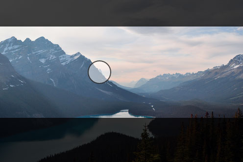
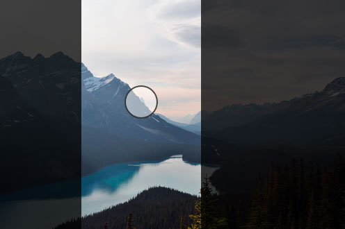

# focal.js

focal.js is a small library that helps users define focal points for images,
ensuring your images look great no matter what crop size is used.






## Usage

Installation is done through [npm][npm].

```bash
$ npm install --save focal.js
```

[npm]: https://www.npmjs.com/


### Basic usage

```html

```

```js
var Focal = require('focal.js');

var img = document.querySelector('img');
var focal = new Focal(img);
```


### API

#### `focal = new Focal(image[, options])`

Create a new instance of Focal.

- `image` - The image to replace
- `options` - Possible options listed below


### Options

- `focus` (`{ x: 50, y: 50 }`) - Position for the focus, both the `x` and `y`
  keys should have a percentage value between 0 and 100.


### Events

Focal utilises node's EventEmitter so you can use `.on` to register for the
events listed below:

- `dragstart` - Fired when the the user presses down on the focus drag
- `dragend` - Fired when the user releases the focus drag
- `change` - Fired when the focus has been changed
